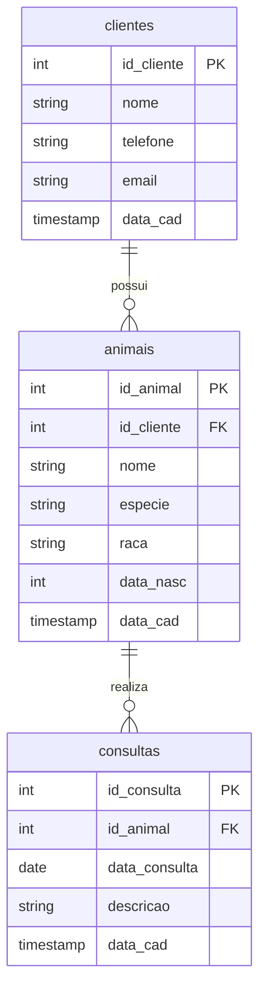

```mermaid
erDiagram
clientes ||--o{ animais : possui
    animais ||--o{ consultas : realiza
clientes {
    int id_cliente PK
    string nome
    string telefone
    string email
    timestamp data_cad
}

animais {
    int id_animal PK
    int id_cliente FK
    string nome
    string especie
    string raca
    int data_nasc
    timestamp data_cad
}

consultas {
    int id_consulta PK
    int id_animal FK
    date data_consulta
    string descricao
    timestamp data_cad
}
```